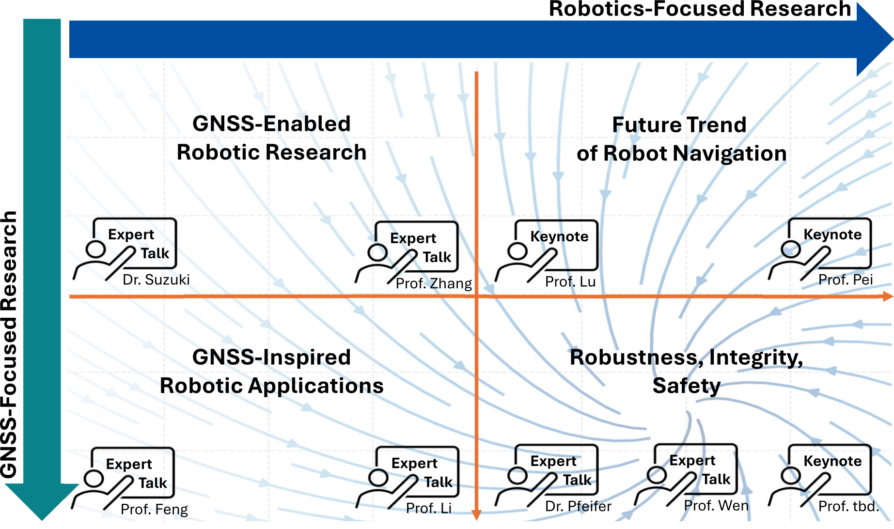

+++
title = "Content"
+++

# Workshop Content

As the first workshop dedicated to exploring synergies and identifying challenges in robotic research enhanced by GNSS and ranging sensors, we follow two leading research directions: robotics-focused and GNSS-focused approaches. In this context, four key topics, as illustrated in Figure 2, which bridge robotics and GNSS research are highlighted and explored through expert talks from academia and industry:

|  | 
|:--:| 
| *Figure 2: Overview of the workshop content, structured around robotics-focused and GNSS-focused directions. Four synergy research topics are explored through expert keynotes and talks.* |

## Topic 1: Future Trend for Robot Navigation

One of the promising future trends of robotics lies in the low-altitude economy, where autonomous systems will revolutionize industries such as logistics, urban mobility, and infrastructure monitoring (Prof. Mingquan Lu). However, for robotics to scale in real-world environments, they must achieve not only high precision but also trustworthy and resilient navigation. This workshop explores how the synergy between robotics and advanced GNSS technologies is shaping the next generation of autonomous systems. 

Beyond conventional approaches, a new frontier is emerging—brain-inspired navigation, which draws from biological principles to enhance robotic intelligence. By mimicking how humans and animals navigate complex environments, brain-inspired algorithms offer an exciting avenue to improve adaptive, real-time decision-making in robotics (Prof. Ling Pei). This innovative direction could reshape how robots perceive and navigate, opening new possibilities for autonomous exploration and interaction.

## Topic 2: GNSS-Enabled Robotic Research
At the heart of robotic autonomy is the ability to perceive and understand the environment with unmatched precision.  This topic focuses on robotic research that integrates GNSS technology to enhance localization and navigation capabilities. Robotic SLAM has made tremendous progress in achieving high-precision relative positioning, enabling robots to localize themselves and map unknown environments with accuracy (Prof. Fu Zhang). However, SLAM alone is insufficient for large-scale deployment, as it lacks the absolute reference needed for long-term reliability.

This is where the fusion of GNSS observations come into play, providing both relative and absolute positioning—a combination that enhances operational robustness in diverse environments (Dr. Taro Suzuki).

## Topic 3: GNSS-Inspired Robotic Applications

Advanced GNSS technologies, such as Precise Point Positioning (PPP) and Real-Time Kinematic (RTK), offer centimeter-level absolute positioning, even in dynamic outdoor environments, providing a critical foundation for robotic autonomy (Prof. Li Xingxing). These technologies have been extensively researched and applied in aviation for decades. As robotics advances, these well-established GNSS methodologies present new opportunities to tackle key challenges in robotic localization and perception.

While high-precision positioning is a key enabler, turning precision into practical, scalable robotic applications requires the right infrastructure and commercial solutions. Over the past decade, commercial GNSS services have played a pivotal role in bringing precise positioning to robotics, enabling applications in automated warehouses, precision agriculture, and drone-based inspection (Prof. Shaojun Feng). As robotics transitions from research to large-scale deployment, accessible and reliable GNSS-based positioning solutions will be the catalyst for wider industry adoption.

## Topic 4: Robustness, Integrity, and Safety

Achieving high precision alone is not enough—robots must also be safe and trustworthy. One of the biggest challenges in autonomous systems is ensuring that navigation is resilient to uncertainties. In robotics, robust estimation techniques allow systems to detect and recover from errors, while in GNSS, integrity monitoring ensures reliability even in challenging environments (Prof. Weisong Wen). These two approaches are converging toward a shared goal: trustworthy automation, where robots can operate safely alongside humans in unstructured and safety-critical environments.

However, real-world robotic navigation often encounters non-Gaussian noise, making conventional probabilistic models insufficient. Addressing this requires advanced noise modeling techniques to ensure robust and stable estimation, further improving the resilience of autonomous systems (Dr. Tim Pfeifer). Given the shared need for robustness and safety in both GNSS and robotics, this topic has the highest potential to foster future first-line research collaborations. By developing advanced algorithms that improve resilience and reliability, researchers from both fields can work together to push the boundaries of autonomous navigation, ensuring safer and more trustworthy systems in diverse and challenging environments.

## Conclusion

In conclusion, the convergence of robotics and GNSS is not just about improving positioning accuracy—it is about building a robust, scalable, and intelligent foundation for the next generation of autonomous systems. By integrating relative and absolute positioning, enhancing robustness against noise, ensuring safety and integrity, and exploring bio-inspired navigation, we can unlock new opportunities for real-world robotic applications.

To further advance this vision, we encourage contributions from students and researchers actively working in these domains. Abstract submissions provide a platform to share novel ideas, preliminary findings, and emerging challenges, fostering dynamic discussions and potential collaborations. Selected submissions will have the opportunity to present their work and receive valuable feedback from experts across academia and industry, strengthening the research community and paving the way for future breakthroughs.

# Workshop Format

Considering the analysis in Figure 1, which highlights the underrepresentation of the research on GNSS and similar ranging sensors within the IEEE RAS community, we decided to organize a full-day workshop featuring high-quality keynotes (see Table 2) to foster a more comprehensive discussion and engagement.